# MisMangas

<p align="center">
  
</p>

<h3 align="center">Manga collection manager for all Apple platforms</h3>

<p align="center">
  
  
  
  
</p>

<p align="center">
  <b>🎓 Final project for Swift Developer Program 2026 — Apple Coding Academy</b><br>
  <i>Completed at Deluxe level: 5 platforms + widgets + Siri Shortcuts</i>
</p>

---


| | Feature | Description |
|:--:|---------|-------------|
| 📱 | **Multi-platform** | Native UI optimized for each Apple platform |
| 📚 | **64,000+ Mangas** | Browse, search, and filter the complete catalog |
| ☁️ | **Cloud Sync** | Collection syncs across devices with conflict resolution |
| 🧩 | **Widgets** | 3 Home Screen sizes + 3 Lock Screen widgets |
| 🗣️ | **Siri Shortcuts** | Voice commands for quick access |
| 💾 | **Offline Mode** | SwiftData persistence with cover caching |
| 🌍 | **4 Languages** | Spanish, English, Arabic, Japanese |

---


<p align="center">
  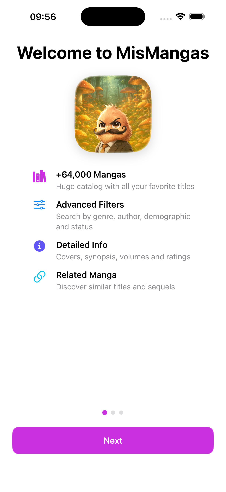
  &nbsp;&nbsp;&nbsp;
  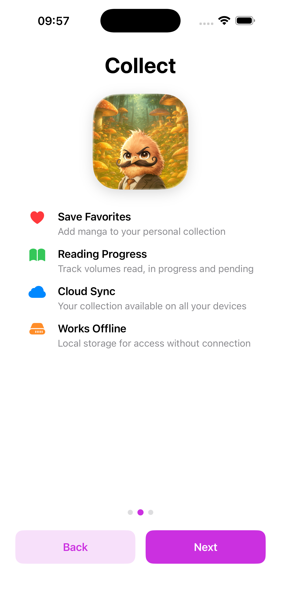
  &nbsp;&nbsp;&nbsp;
  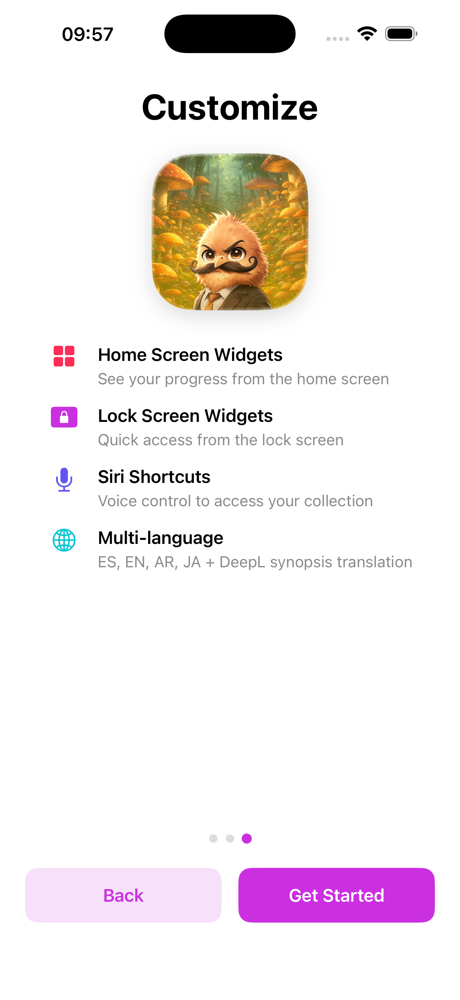
</p>

---


<p align="center">
  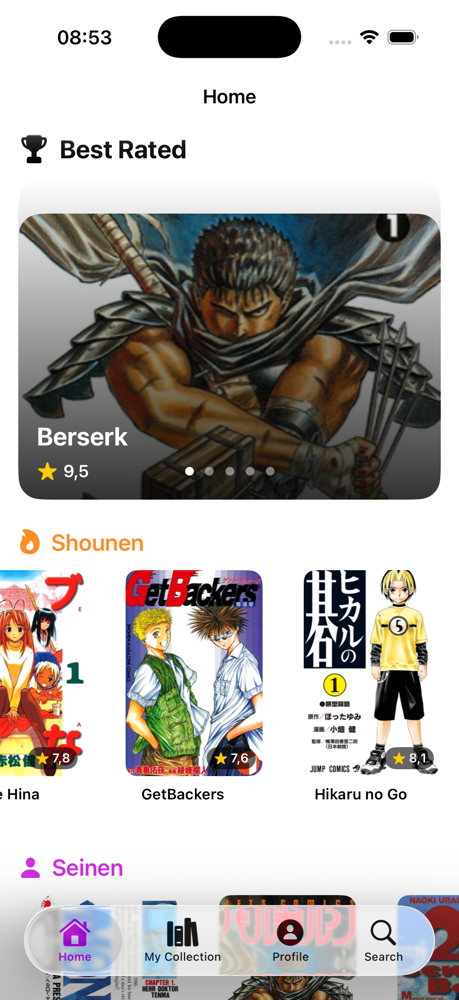
  &nbsp;&nbsp;&nbsp;
  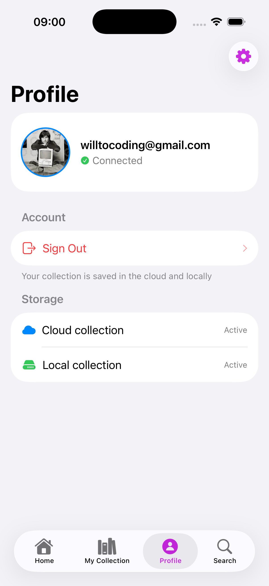
</p>

- Tab navigation with adaptive layouts
- Haptic feedback throughout the app
- Siri Shortcuts with App Intents
- Photo picker for profile image
- Pull-to-refresh and infinite scroll
- Swipe actions for quick collection management
- Dynamic Type and VoiceOver support

---


<p align="center">
  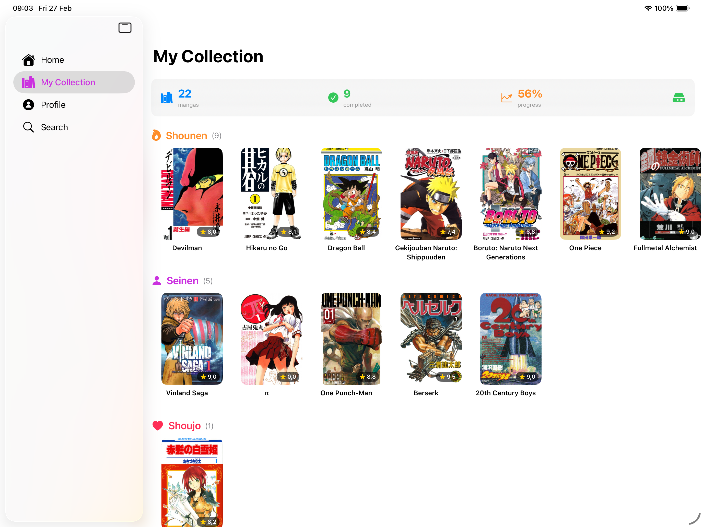
  &nbsp;&nbsp;
  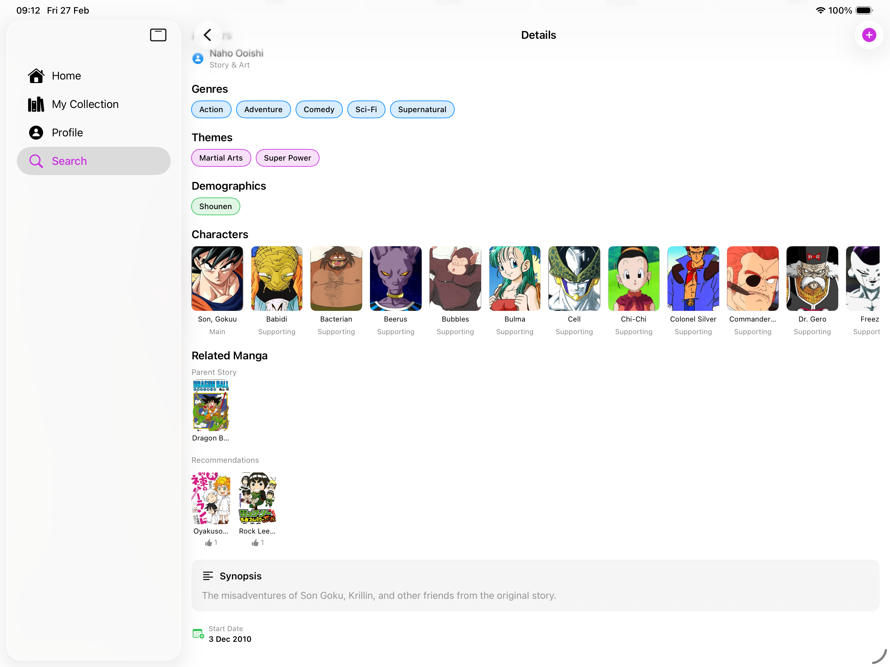
</p>

- Split view navigation optimized for large screens
- Adaptive grid layouts for all orientations
- Swipe actions for collection management

---


<p align="center">
  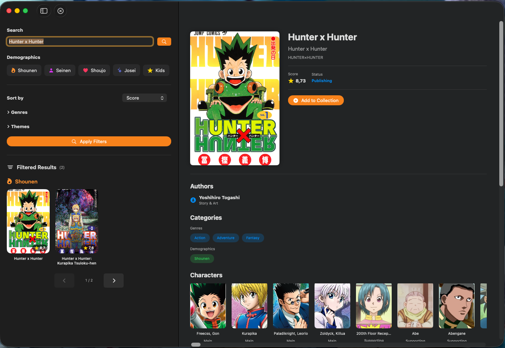
  &nbsp;&nbsp;
  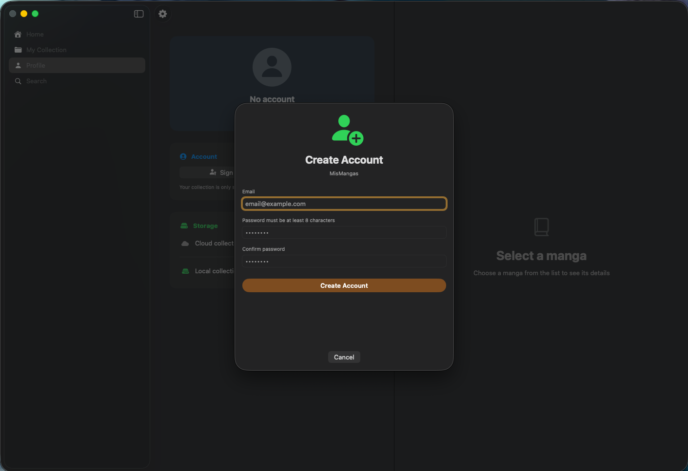
</p>

- 3-column NavigationSplitView
- Keyboard shortcuts: `⌘R` refresh, `⌘,` preferences
- Menu bar commands and toolbar actions
- Resizable window (min 900×600)
- Native macOS settings panel
- Right-click context menus

---


<p align="center">
  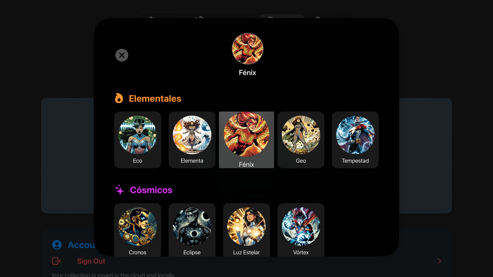
  &nbsp;&nbsp;
  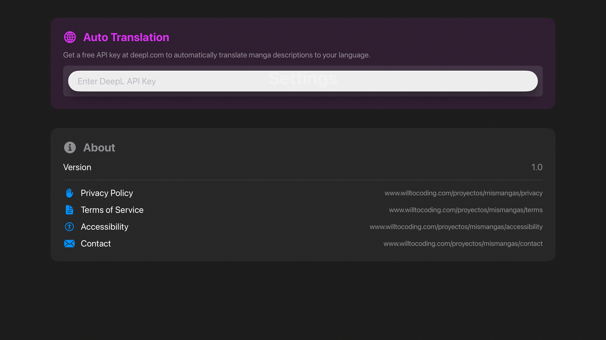
</p>

- Focus Engine navigation with Siri Remote
- Hero carousel with top-rated mangas
- Large cards (400×600) optimized for 10-foot UI
- 20 selectable avatars in 5 categories
- Haptic feedback (Siri Remote 2nd gen+)

---


<p align="center">
  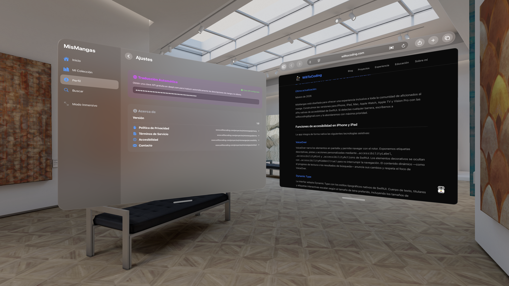
</p>

<p align="center">
  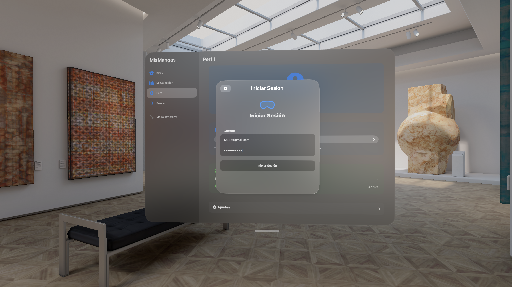
  &nbsp;&nbsp;
  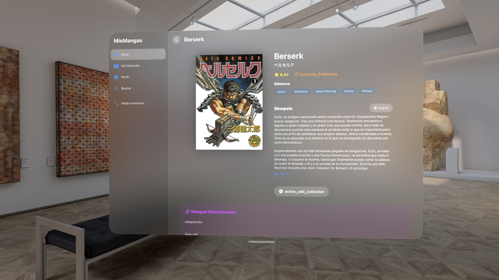
</p>

- **Immersive 3D Gallery** — Circular layout with up to 12 mangas
- RealityKit rendering with spatial gestures
- Glassmorphic cards with hover effects
- Full collection management with cloud sync
- DeepL translation support

---


<p align="center">
  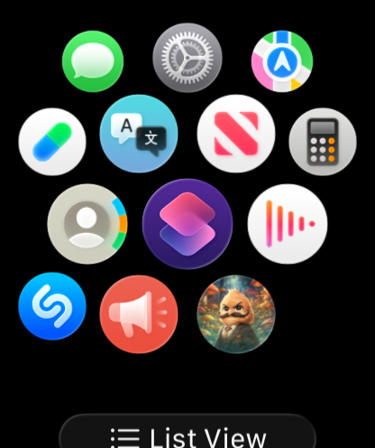
  &nbsp;&nbsp;&nbsp;
  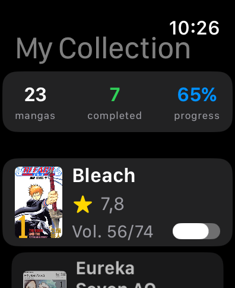
</p>

- Compact collection list with cover thumbnails
- Swipe "+1" for quick volume tracking
- Stats header with reading progress
- Shared session via iPhone Keychain

---


<p align="center">
  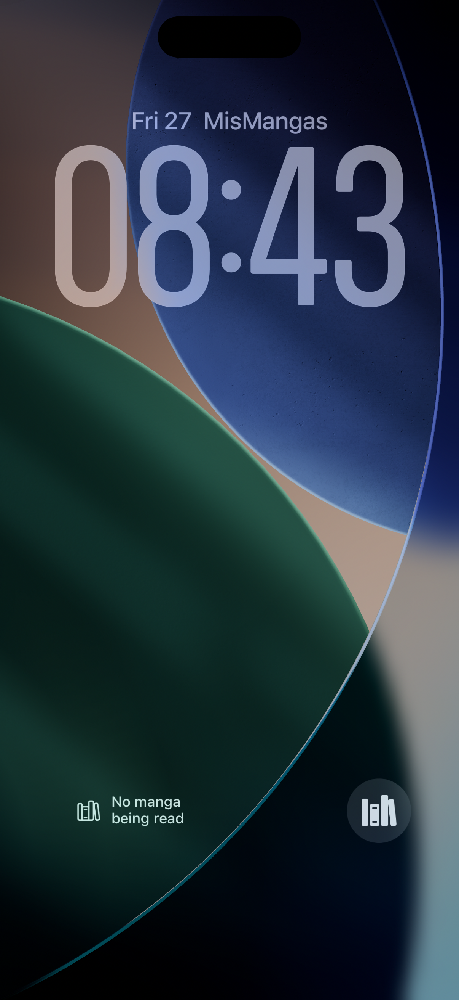
  &nbsp;&nbsp;&nbsp;&nbsp;
  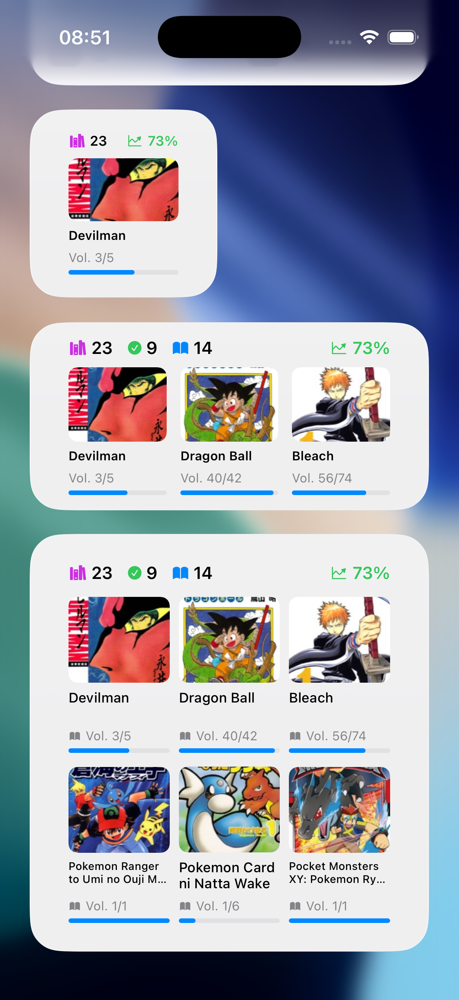
</p>

**Home Screen**
| Size | Mangas | Stats |
|:----:|:------:|:-----:|
| Small | 1 | Total + Progress |
| Medium | 3 | Total + Completed + Reading + Progress |
| Large | 6 | Total + Completed + Reading + Progress |

**Lock Screen**
| Type | Content |
|:----:|:--------|
| Circular | Progress gauge + volume |
| Rectangular | Title + Vol. X/Y + progress bar |
| Inline | "Title - Vol. X/Y" |

---


Clean Architecture + MVVM. **Zero third-party dependencies** — pure Apple frameworks.

```
┌─────────────────────────────────────────┐
│          Presentation Layer             │
│     Views · ViewModels · Components     │
└───────────────────┬─────────────────────┘
                    │
┌───────────────────▼─────────────────────┐
│            Domain Layer                 │
│       Models · DTOs · Protocols         │
└───────────────────┬─────────────────────┘
                    │
┌───────────────────▼─────────────────────┐
│             Data Layer                  │
│     Network · Storage · SwiftData       │
└─────────────────────────────────────────┘
```

---


| Category | Technologies |
|:--------:|-------------|
| **UI** | SwiftUI, RealityKit, WidgetKit, AppIntents |
| **Data** | SwiftData, Keychain, App Groups |
| **Async** | async/await, @Observable, Sendable, Actors |
| **APIs** | Academy API, Jikan API, DeepL API |
| **Testing** | Swift Testing (100+ tests) |
| **Localization** | String Catalogs (xcstrings) |

---


| Platform | Key Frameworks |
|:--------:|----------------|
| **iOS/iPadOS** | WidgetKit, AppIntents, PhotosUI |
| **macOS** | AppKit integration, Settings |
| **tvOS** | TVUIKit, Focus Engine |
| **visionOS** | RealityKit, Spatial Frameworks |
| **watchOS** | WatchKit, ClockKit |
| **Shared** | SwiftUI, SwiftData, Foundation, Security (Keychain) |

---


```
MisMangas/
├── 📱 MisMangas/                    # iOS/iPadOS shared code
├── 🖥️ MisMangas macOS/              # macOS target
├── 📺 MisMangas tvOS/               # tvOS target
├── 🥽 MisMangas visionOS/           # visionOS target
├── ⌚ MisMangas watchOS Watch App/  # watchOS target
├── 🧩 MisMangas widget/             # WidgetKit extension
├── 🧪 MisMangasTests/               # Unit tests
└── 📦 Packages/                     # Local packages

Package Dependencies/
└── 🔗 NetworkAPI (local)            # Async/await networking
```

---


| API | Purpose | Auth |
|:---:|---------|:----:|
| [**Academy**](https://mymanga-acacademy-5607149ebe3d.herokuapp.com/docs) | Catalog, users, collections | App-Token + JWT |
| [**Jikan**](https://jikan.moe) | Characters, related mangas | None |
| [**DeepL**](https://deepl.com/docs-api) | Synopsis translation | API Key |

---


| What | Where |
|:----:|-------|
| JWT Tokens | iOS Keychain (hardware encrypted) |
| API Keys | `AppConfig.swift` (gitignored) |
| DeepL Key | User-provided, stored in Keychain |
| Sync | iCloud Keychain across devices |

---


**Swift Testing** with dependency injection and mocks.

```swift
@Suite("MangaViewModel Tests")
struct MangaVMTests {
    @Test("Fetches mangas successfully")
    func fetchMangas() async {
        let vm = MangaViewModel(repository: NetworkTest())
        await vm.fetchMangas()
        #expect(vm.mangas.count > 0)
    }
}
```

| Mock | Purpose |
|:----:|---------|
| `NetworkTest` | Returns test data |
| `NetworkTestWithError` | Simulates network errors |

---


| Language | Code | Coverage |
|:--------:|:----:|:--------:|
| 🇪🇸 Spanish | `ES` | 100% |
| 🇺🇸 English | `EN` | 98.5% |
| 🇸🇦 Arabic | `AR` | 98.5% |
| 🇯🇵 Japanese | `JA` | 98.5% |

**452 localized strings** using String Catalogs (xcstrings)

---


- **150 accessibility labels** across all platforms
- VoiceOver optimized with semantic headers (H1, H2, H3)
- Dynamic Type support
- Reduce Motion / Reduce Transparency respected
- High contrast mode compatible

---


| Platform | Version |
|:--------:|:-------:|
| iOS / iPadOS | 26.2+ |
| macOS | 26.2+ |
| tvOS | 26.2+ |
| watchOS | 26.2+ |
| visionOS | 26.2+ |
| Xcode | 26.2+ |

---


```bash
git clone https://github.com/WillToCoding/MisMangas.git
cd MisMangas
cp MisMangas/AppConfig.example.swift MisMangas/AppConfig.swift
```

Edit `AppConfig.swift` with your tokens:

```swift
enum AppConfig {
    static let academyToken = "YOUR_ACADEMY_TOKEN"
    static let deepLToken = "YOUR_DEEPL_TOKEN"  // Optional
}
```

```bash
open MisMangas.xcodeproj
```

---


| Package | Purpose |
|:-------:|---------|
| [**NetworkAPI**](https://github.com/WillToCoding/NetworkAPI) | Async/await networking layer |

---

<p align="center">
  <b>MIT License</b> · Made with ❤️ by <b>Juan Carlos</b>
</p>

<p align="center">
  <i>Swift Developer Program 2026 — Apple Coding Academy</i>
</p>
