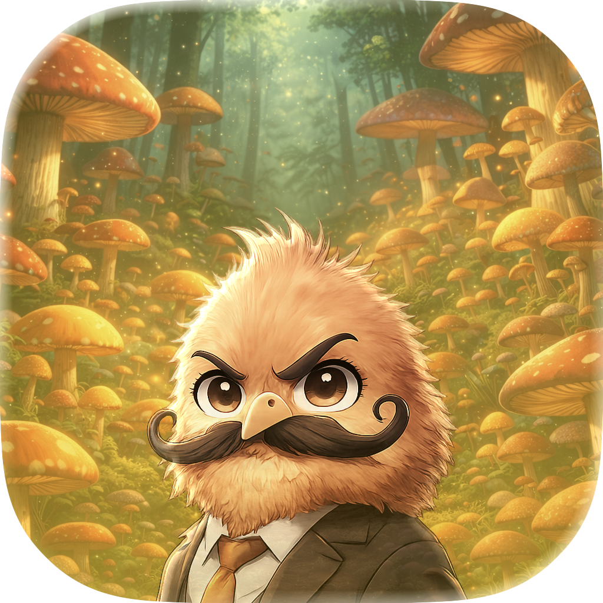
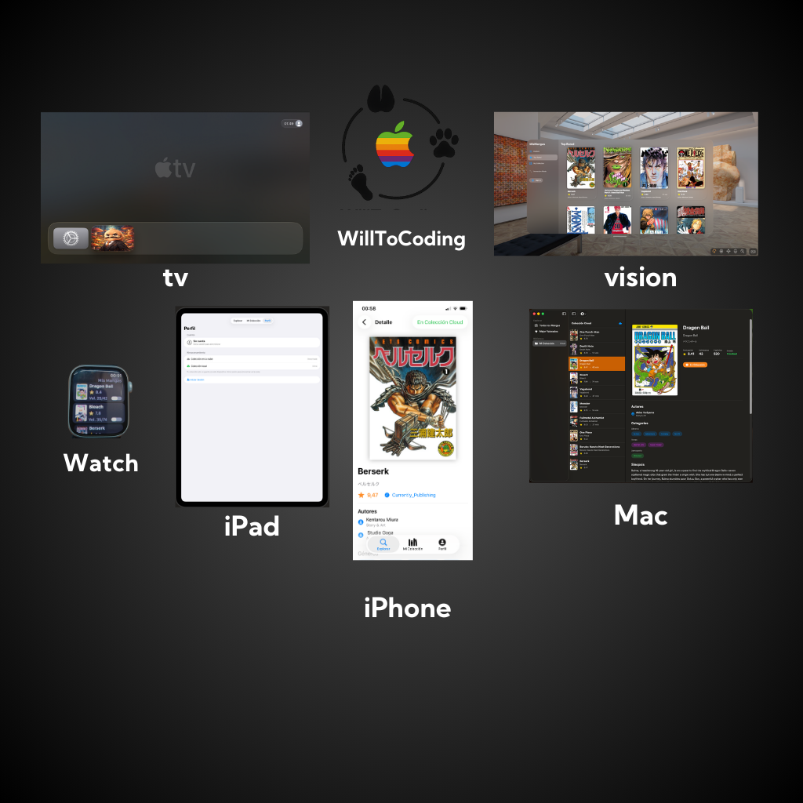

# MisMangas

<p align="center">
  
</p>

<p align="center">
  Gestiona tu colección de manga en todas las plataformas Apple.
</p>

<p align="center">
  
  
  
</p>

<p align="center">
  
</p>

## Características

- Explora +64,000 mangas con filtros avanzados
- Guarda tu colección y registra progreso de lectura
- Sincronización en la nube entre dispositivos
- Widgets para Home Screen y Lock Screen
- Siri Shortcuts
- Soporte para ES, EN, AR, JA

## Requisitos

- iOS/iPadOS 26.1+
- macOS 26.1+
- watchOS 26.1+
- tvOS 26.1+
- visionOS 26.1+
- Xcode 26+

## Instalación

```bash
git clone https://github.com/WillToCoding/MisMangas.git
cd MisMangas
cp MisMangas/AppConfig.example.swift MisMangas/AppConfig.swift
# Añade tu token en AppConfig.swift
open MisMangas.xcodeproj
```

## Dependencias

- [NetworkAPI](https://github.com/WillToCoding/NetworkAPI) - Networking async/await

## Arquitectura

SwiftUI + SwiftData + Clean Architecture (MVVM)

```
Presentation  →  Views, ViewModels, Components
Domain        →  Models (Academy, Jikan)
Data          →  Network, Storage, DataModel
```

## APIs

| API | Uso |
|-----|-----|
| Academy | Catálogo, autenticación, colecciones |
| [Jikan](https://jikan.moe) | Personajes, relaciones |
| [DeepL](https://deepl.com) | Traducción de sinopsis |

## Licencia

MIT
